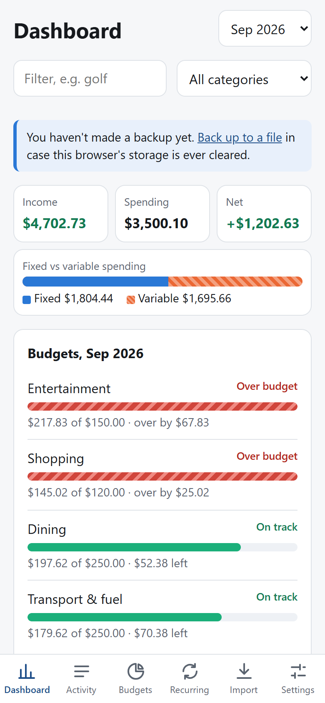
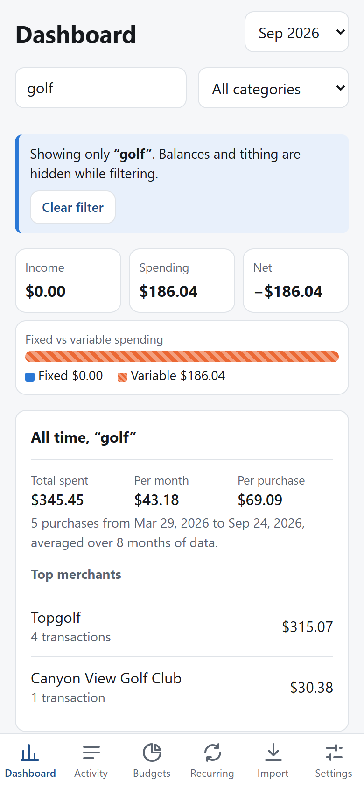
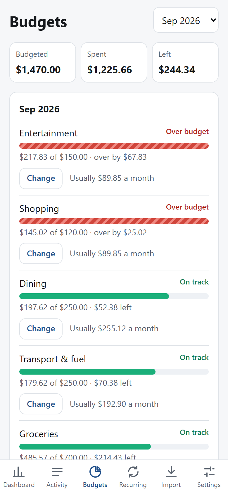
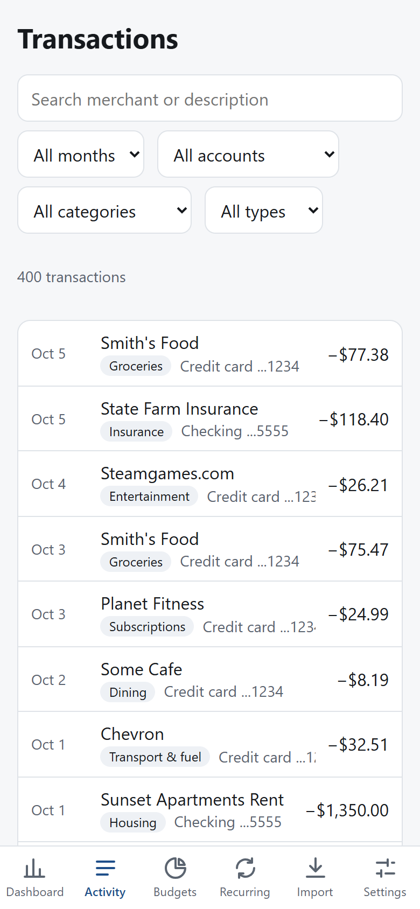
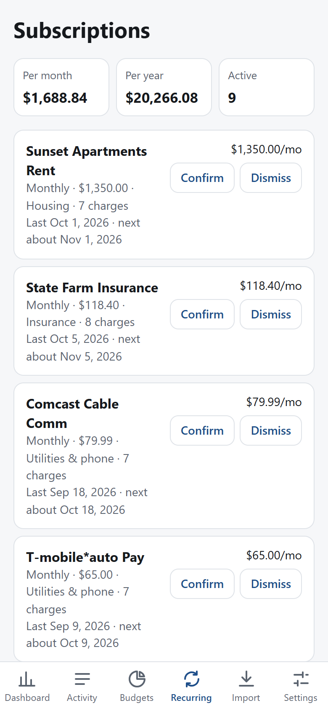

# Tally: a local-first personal budgeting PWA

> **This README is the build spec.** It is written so an AI coding agent (Cursor) can build the whole
> app from it, and so a human can understand every design decision later. Read it fully before writing code.

**Status:** All four milestones are built: 1 (foundation and import), 2 (classification, dashboard, subscriptions), 3 (backup,
PWA install, deploy), and 4 (budgets and polish). The on-iPhone checks are for the owner (below). See section 19 for where the
build refines this spec.

**Live app:** https://tkchild1.github.io/tally/ (deployed by GitHub Actions on every push to `main`).

Screenshots use the built-in **fake demo data** only:

<p>
  
  
  
  
  
</p>

### Install on iPhone
1. Open the live app link in **Safari** (not Chrome; only Safari can add web apps to the Home Screen).
2. Tap **Share** (the square with an arrow), then **Add to Home Screen**, then **Add**.
3. Open Tally **from the Home Screen icon** and import your exports there. The Home Screen app and the Safari tab keep
   separate data, and only the Home Screen app is protected from Safari's 7-day storage cleanup.
4. Settings > Storage should say persistent storage is granted (iOS may only grant it to the Home Screen app).
5. Check offline: turn on Airplane Mode, close Tally fully (swipe it away), reopen it. It should open with your data.
6. Back up monthly: Settings > Backup with a passphrase, then save the file to iCloud Drive or Files.

Updates install themselves: after a new version is deployed, the next launch (sometimes the one after) picks it up.

```
npm install
npm run dev          # http://localhost:5173  (dev:phone exposes it on your Wi-Fi)
npm test             # Vitest, fake data only
npm run typecheck
npm run build
npm run fake         # regenerate sample-data/*.qfx (fake)
npm run redact -- path/to/file.qfx [--scrub-names] [--scrub-amounts]
npm run icons        # regenerate public/*.png icons
```

---

## 0. How to use this with Cursor

1. Create an empty folder (e.g. `Documents/projects/tally`), open it in Cursor, and save this file as `README.md` in it.
2. Paste this kickoff prompt into Cursor's agent chat:

   > Read README.md completely. It is the spec for the app. First, create `AGENTS.md` and `.cursor/rules/tally.mdc`
   > containing the "Hard invariants" (section 3) and "Conventions" (section 17) verbatim. Then build **Milestone 1**
   > from section 14 only. Run the tests and typecheck. Stop and summarize when Milestone 1's acceptance criteria pass.
   > Do not start Milestone 2 until I say so.

3. Work **one milestone at a time**. After each one: run `npm test`, `npm run typecheck`, `npm run dev`, check it
   in the browser, then `git commit`. Small commits also make a good interview story.
4. When something in this spec turns out wrong or a library API differs from what is written, **trust the
   installed library's docs and types over this file**, then update this README so it stays true.
5. **Never give Cursor (or any AI tool, or GitHub) real bank exports.** See section 3.

---

## 1. Goal and scope

A personal finance app for **one user** (the owner) that works like a small Rocket Money / YNAB:

- See **all subscriptions** (recurring charges), with monthly and yearly cost.
- **Categorize spending** automatically, and learn from the user's corrections.
- See **total income** (money coming in) per month.
- **Budget**: monthly limits per category vs. actual spending (Milestone 4).
- See **account balances** and a **balance-over-time** chart.
- Optionally view **fixed vs. variable** spending (each category has a fixed/variable flag).

It runs as a **Progressive Web App (PWA)** on the owner's iPhone (installed via Safari > Share > Add to Home Screen)
and in a desktop browser. **There is no backend and no account system. All financial data stays on the device.**

### Non-goals (do not build these)

- No bank API / Plaid / credential handling (maybe much later; see section 16).
- No multi-user support, login, or server-side database.
- No cloud sync. (Backup is a manual encrypted file export.)
- No native iOS app. The owner has no Mac. Stay a PWA.
- No PDF statement parsing. The QFX exports contain everything needed, including balances.
- No AI/LLM calls from the app. Nothing financial is ever sent anywhere.

### Why this project exists

It is also an **interview portfolio piece**. Prefer clear, well-reasoned, well-tested designs over clever ones, and keep
the "design decisions" (this document) accurate. Section 18 lists the talking points.

---

## 2. Owner context (design for this person)

- Information Systems student; comfortable with React, TypeScript/JavaScript, SQL, Postgres (pgAdmin), the terminal, Git.
- Develops on **Windows**; target device is an **iPhone**.
- Bank: **PNC** (one checking account, one credit card to start; savings possible later).
- Weekly workflow: download QFX files from PNC online banking, open the app, import them. Overlapping date
  ranges between weekly exports are expected and must be handled gracefully.
- All npm scripts must work on Windows (use `tsx`, not bash one-liners; no `rm -rf`, `cp`, `export VAR=...` in scripts).

---

## 3. Hard invariants (security, data, correctness)

These are non-negotiable. Copy them into `AGENTS.md` and `.cursor/rules/tally.mdc`.

### Security and privacy
1. **No real financial data in the repo, ever.** Not in code, tests, fixtures, docs, commit messages, or screenshots.
   `.gitignore` must exclude `*.qfx`, `*.qbo`, `*.ofx`, `*.csv`, `*.budgetbackup.json`, `exports/`, `private/`
   (with an explicit allow-list exception for `sample-data/*.qfx`, which are **fake and generated**).
2. **No network calls with user data.** The app makes no `fetch`/XHR/analytics/telemetry calls to anything (aside from
   the service worker loading its own static assets). No third-party scripts, fonts, or CDNs at runtime.
3. **Never store a full account or card number.** Store only the last 4 digits plus a SHA-256 hash used as a stable key.
   The hash only avoids storing plaintext; it is not encryption (a 16-digit card number is brute-forceable from its hash).
   The real protection is device encryption and passcode. Say this honestly in the docs.
4. **Bank FITIDs can embed the full card number.** (Real card exports do: the FITID starts with the 16-digit card number.)
   Strip the account number out of the FITID before storing it (replace with a placeholder like `{ACCT}`).
5. **Never log or print** raw account numbers, FITIDs, transaction descriptions, or balances: not in `console.log`, error
   messages, or test output. Errors may mention counts and field names only.
6. Backups are plain JSON containing the whole transaction history. Offer **optional passphrase encryption**
   (WebCrypto AES-GCM, key from PBKDF2-SHA256 with >= 600,000 iterations, random salt and IV; format versioned) and warn
   when exporting unencrypted.
7. No secrets in code. (There should be none: no API keys exist in this app.)

### Correctness
8. **Money is integer cents.** Never store or compute with floating-point dollars. Parse amount strings with string
   math. Sign convention everywhere: **money out is negative, money in is positive.**
9. **Dates are calendar dates (`YYYY-MM-DD`), never timestamps.** Bank exports fake the time (checking uses `000000`, cards
   use `120000`); timezone conversion would shift transactions to the wrong day. Keep only the first 8 digits of OFX dates. Do
   date math in UTC on the calendar date. In Postgres use `DATE`, and `SELECT col::text` so the driver does not turn it
   into a JS `Date`.
10. **Dedupe by `(account_id, fitid)`.** Re-importing an overlapping file must create zero duplicates, and must be a no-op
    when the same file is imported twice.
11. **Classification is idempotent and respects user edits.** Anything the user edited by hand is "locked" and is never
    changed by automatic re-classification.
12. **Transfers between the user's own accounts are neither spending nor income.** (See 9.3.)
13. Pure logic (parsing, classification, subscription detection, balances) lives in `src/lib/` with **no DOM, no React,
    no DB imports**, so it is trivially unit-testable.

---

## 4. Tech stack

| Concern | Choice | Notes |
|---|---|---|
| Language | TypeScript (strict) | `noUncheckedIndexedAccess` on |
| UI | React + Vite | mobile-first |
| Database | **PGlite** (`@electric-sql/pglite`): Postgres compiled to WASM, persisted in IndexedDB via `idb://tally` | Matches the owner's Postgres skills; SQL makes monthly/category aggregation easy |
| Charts | Recharts | |
| PWA | `vite-plugin-pwa` (manifest + Workbox service worker, `registerType: 'autoUpdate'`) | |
| Tests | Vitest (node environment) | DB tests run against **in-memory PGlite** (`new PGlite()`) |
| Scripts | `tsx` | cross-platform |
| Hosting | Static hosting only: Cloudflare Pages or GitHub Pages | Free; no domain or server needed |

Use current stable versions; pin whatever installs. Node >= 20.

### PGlite specifics to get right
- Keep PGlite behind one module (`src/db/client.ts`) so swapping to SQLite-WASM later is contained.
- Vite config needs `optimizeDeps: { exclude: ['@electric-sql/pglite'] }`.
- PGlite's WASM/data files are large (~10 MB). Raise Workbox's `maximumFileSizeToCacheInBytes` (e.g. 40 MB) and include `wasm`/`data` in
  `globPatterns` so the app is available offline.
- `DATE` columns come back as JS `Date` objects (timezone bugs); **always select `::text`**. `SUM()`/`COUNT()` return `bigint`;
  **cast to `::int` or `::float8`** in queries. Store money in `INTEGER` cents columns.
- PGlite is single-connection. **Two tabs/windows open at once on the same `idb://` store can corrupt or conflict.** For v1,
  document it, and optionally use a `BroadcastChannel`/`navigator.locks` guard that shows "Tally is open in another tab". Do not
  build leader election in v1.
- Call `navigator.storage.persist()` (best effort) at startup and show the result in Settings.
- Repo functions take a minimal `Queryable` interface (`{ query(sql, params) => Promise<{rows}> }`) so they work with both
  the `PGlite` instance and a transaction handle, and tests can inject an in-memory instance.

---

## 5. Data source: PNC QFX exports

The owner exports from PNC online banking (Transactions > Export > `.qfx`). Checking and credit card each export one
file. `.qbo` is the same OFX format, so the same parser handles both. Format facts:

- **OFX 1.x SGML**: leaf tags have **no closing tags** (`<TRNAMT>585.07<FITID>...`), so a normal XML parser fails. Write a small tolerant
  parser: find aggregate blocks with regexes, read leaves with `<TAG>value` up to the next `<` or line break. This also works for OFX 2.x XML.
- Header lines (`OFXHEADER:100`, `DATA:OFXSGML`, ...) precede the `<OFX>` tag.
- **Checking** uses `<STMTRS>` with `<BANKACCTFROM>` (`BANKID`, `ACCTID`, `ACCTTYPE`). The account id is already masked (like `x1234`).
  Posted time is `000000`. Transactions have a `MEMO` that holds the **full** description; `NAME` is **truncated to 32 characters**.
- **Credit card** uses `<CCSTMTRS>` with `<CCACCTFROM>` (`ACCTID` only). **`ACCTID` is the full unmasked card number**, and **every
  `FITID` begins with that full number** (see invariant 4). Posted time is `120000`. No `MEMO`. Merchant names look like
  `SQ *SOME CAFE Provo UT` (processor prefix, city, state).
- Both have `<LEDGERBAL><BALAMT>..<DTASOF>..` (balance snapshot with an as-of date). Card balance is **negative = amount owed**.
- Both have `<BANKTRANLIST><DTSTART>..<DTEND>..` which is the date range the export covers.
- **Pending transactions are not in the file** (they show in the web UI only). Card balances can therefore lag until items post.
- **There are no categories in the file.** Categorization is entirely done by the app.
- Amounts: money out negative, money in positive, in both account types.
- A checking transfer to the card appears as e.g. `MOBILE PAYMENT TO XXXXX1234` (the masked reference is the **last 4 of the card**),
  and on the card as a positive `PAYMENT`.
- The same transaction keeps the same `FITID` across overlapping exports. (Verify with the owner's real files once the importer works.)

### Fake example (structure only; every value is made up)

```
OFXHEADER:100
DATA:OFXSGML
VERSION:102
SECURITY:NONE
ENCODING:USASCII
CHARSET:1252
COMPRESSION:NONE
OLDFILEUID:NONE
NEWFILEUID:NONE

<OFX><SIGNONMSGSRSV1><SONRS><STATUS><CODE>0<SEVERITY>INFO</STATUS><DTSERVER>20260102000000.000<LANGUAGE>ENG<FI><ORG>BANK<FID>0000</FI></SONRS></SIGNONMSGSRSV1><BANKMSGSRSV1><STMTTRNRS><TRNUID>1<STATUS><CODE>0<SEVERITY>INFO</STATUS><STMTRS><CURDEF>USD<BANKACCTFROM><BANKID>000000000<ACCTID>x5555<ACCTTYPE>CHECKING</BANKACCTFROM><BANKTRANLIST><DTSTART>20251102000000.000<DTEND>20260102000000.000<STMTTRN><TRNTYPE>CREDIT<DTPOSTED>20251219000000.000<DTUSER>20251219000000.000<TRNAMT>2350.00<FITID>900000000000000001#1#071#2025-12-19#<NAME>ACME CORP PAYROLL ACH CREDIT E<MEMO>ACME CORP PAYROLL ACH CREDIT EFTxxxxx9999</STMTTRN><STMTTRN><TRNTYPE>DEBIT<DTPOSTED>20251220000000.000<DTUSER>20251220000000.000<TRNAMT>-250.00<FITID>900000000000000002#1#071#2025-12-20#<NAME>MOBILE PAYMENT TO XXXXX1234<MEMO>MOBILE PAYMENT TO XXXXX1234</STMTTRN></BANKTRANLIST><LEDGERBAL><BALAMT>4100.50<DTASOF>20260102000000.000</LEDGERBAL></STMTRS></STMTTRNRS></BANKMSGSRSV1></OFX>
```

Card version (fake card number `4000000000001234`; note the FITID prefix):

```
...<CREDITCARDMSGSRSV1><CCSTMTTRNRS><TRNUID>0<STATUS><CODE>0<SEVERITY>INFO</STATUS><CCSTMTRS><CURDEF>USD<CCACCTFROM><ACCTID>4000000000001234</CCACCTFROM><BANKTRANLIST><DTSTART>20251202120000.000<DTEND>20260102235900.000<STMTTRN><TRNTYPE>DEBIT<DTPOSTED>20251226120000.000<DTUSER>20251226120000.000<TRNAMT>-8.65<FITID>40000000000012340466269716891196<NAME>SQ *SOME CAFE Provo UT</STMTTRN><STMTTRN><TRNTYPE>CREDIT<DTPOSTED>20251222120000.000<DTUSER>20251222120000.000<TRNAMT>250.00<FITID>40000000000012340356267108024957<NAME>PAYMENT</STMTTRN></BANKTRANLIST><LEDGERBAL><BALAMT>-312.40<DTASOF>20260102235900.000</LEDGERBAL></CCSTMTRS></CCSTMTTRNRS></CREDITCARDMSGSRSV1></OFX>
```

---

## 6. Architecture and layout

Everything runs in the browser. Data flow:

```
 QFX file (user picks/drops)
      |  FileReader (in browser)
      v
 parseQfx()  ---- pure, src/lib/qfx.ts
      v
 importer (src/db/importer.ts): hash account id, sanitize FITIDs, insert with ON CONFLICT DO NOTHING,
      store balance snapshot + coverage range
      v
 classify (pure, src/lib/classify.ts): flow (spend/income/transfer) + category, respecting locked rows
      v
 PGlite (IndexedDB, on device)  <----  repo queries (src/db/repo.ts)  <----  React UI
```

```
src/
  main.tsx, App.tsx, styles.css
  lib/                     # PURE logic, no DOM/React/DB imports
    money.ts               # parseAmountToCents (string-based), centsToDecimal, formatCents
    dates.ts               # ISODate helpers: daysBetween, addDays, addMonths, parseOfxDate, todayISO
    hash.ts                # sha256Hex via crypto.subtle
    qfx.ts                 # parseQfx, last4Of, sanitizeFitid
    merchant.ts            # normalizeMerchant, prettyMerchant
    categories.ts          # DEFAULT_CATEGORIES, DEFAULT_RULES, NOT_AUTO_SUBSCRIPTION
    classify.ts            # classifyTransactions (flow + category + transfer pairing)
    subscriptions.ts       # detectSubscriptions
    balance.ts             # balanceSeries, mergeCoverage
    redact.ts              # redactQfx, countUnmaskedDigitRuns
    backup.ts              # export/import JSON + AES-GCM encryption (no DB import: takes rows)
    fake.ts                # deterministic fake QFX generator (also powers in-app demo mode)
  db/
    client.ts              # the ONLY place that constructs PGlite (idb://tally); migrate on open
    schema.ts              # SQL migrations, versioned via a meta table
    repo.ts                # all SQL: reads for UI, writes for edits
    importer.ts            # import pipeline
  ui/
    hooks.ts, format.ts
    components/            # Card, Money, CategorySelect, TransactionSheet, Tabs, Banner
    pages/                 # Dashboard, Transactions, Subscriptions, Import, Settings (+ Budgets in M4)
scripts/
  generate-fake-data.ts    # writes fake QFX files to sample-data/
  redact.ts                # CLI: npm run redact -- path/to/file.qfx
tests/                     # *.test.ts (Vitest)
sample-data/               # FAKE generated .qfx files (committed; allowed by .gitignore)
public/                    # icon.svg, icon-192.png, icon-512.png, apple-touch-icon.png
```

Routing: a tiny hash router (`#/transactions`); no router dependency. Navigation: bottom tab bar on phones, top bar on wide screens.

---

## 7. Data model (PGlite / Postgres)

Account identity key: `sha256(kind|bankId|acctId)` hex (first 32 chars). Never store the raw `acctId`.

```sql
CREATE TABLE meta (key text PRIMARY KEY, value text NOT NULL);           -- schema_version, etc.

CREATE TABLE accounts (
  id           text PRIMARY KEY,                                          -- hashed key
  kind         text NOT NULL CHECK (kind IN ('checking','savings','credit_card')),
  last4        text NOT NULL,
  display_name text NOT NULL,                                             -- e.g. "Checking ...5555"; user-editable
  created_at   timestamptz NOT NULL DEFAULT now()
);

CREATE TABLE balance_snapshots (                                          -- from LEDGERBAL
  account_id    text NOT NULL REFERENCES accounts(id) ON DELETE CASCADE,
  as_of         date NOT NULL,
  balance_cents integer NOT NULL,                                         -- card: negative = owed
  PRIMARY KEY (account_id, as_of)
);

CREATE TABLE imports (                                                    -- one row per statement per file; powers coverage-gap warnings
  id          serial PRIMARY KEY,
  account_id  text NOT NULL REFERENCES accounts(id) ON DELETE CASCADE,
  file_name   text,
  range_start date, range_end date,                                       -- DTSTART / DTEND
  imported_at timestamptz NOT NULL DEFAULT now(),
  txn_total   integer NOT NULL, txn_new integer NOT NULL
);

CREATE TABLE categories (
  id       text PRIMARY KEY,                                              -- slug, seeded from code
  name     text NOT NULL,
  kind     text NOT NULL CHECK (kind IN ('income','expense','system')),
  is_fixed boolean NOT NULL DEFAULT false                                 -- fixed vs variable; user-editable
);

CREATE TABLE transactions (
  id              serial PRIMARY KEY,
  account_id      text NOT NULL REFERENCES accounts(id) ON DELETE CASCADE,
  fitid           text NOT NULL,                                          -- bank id with account number removed
  posted_on       date NOT NULL,
  amount_cents    integer NOT NULL,                                       -- out negative, in positive
  trn_type        text,
  raw_name        text NOT NULL,
  raw_memo        text,
  merchant        text NOT NULL,                                          -- normalized, UPPERCASE
  flow            text NOT NULL CHECK (flow IN ('spend','income','transfer')),
  flow_source     text NOT NULL DEFAULT 'auto' CHECK (flow_source IN ('auto','user')),
  category_id     text NOT NULL REFERENCES categories(id),
  category_source text NOT NULL DEFAULT 'auto' CHECK (category_source IN ('auto','user')),
  transfer_group  text,                                                   -- ties the two sides of a transfer
  transfer_hint   text,                                                   -- last4 referenced but no matching account imported
  UNIQUE (account_id, fitid)
);
CREATE INDEX transactions_posted_idx   ON transactions (posted_on);
CREATE INDEX transactions_merchant_idx ON transactions (merchant);

CREATE TABLE merchant_rules (                                             -- created when the user corrects a category
  id          serial PRIMARY KEY,
  match_type  text NOT NULL CHECK (match_type IN ('equals','contains')),
  pattern     text NOT NULL,
  category_id text NOT NULL REFERENCES categories(id),
  UNIQUE (match_type, pattern)
);

CREATE TABLE merchant_flags (                                             -- user confirms/dismisses detected subscriptions
  merchant text PRIMARY KEY,
  state    text NOT NULL CHECK (state IN ('confirmed','dismissed'))
);

CREATE TABLE budgets (                                                    -- Milestone 4
  category_id   text PRIMARY KEY REFERENCES categories(id),
  monthly_cents integer NOT NULL CHECK (monthly_cents >= 0)
);
```

Migrations: a list of numbered SQL strings; on open, read `meta.schema_version` and apply the missing ones in a transaction.

---

## 8. Import pipeline (`src/db/importer.ts`)

For each selected file (multiple allowed):

1. Read text, `parseQfx(text)` gives statements `{kind, acctId, bankId, rangeStart, rangeEnd, ledgerBalance, transactions[]}` + warnings.
   Unparseable file -> show a clear message, import nothing from that file.
2. Per statement, inside **one DB transaction**:
   - `accountKey = sha256(kind|bankId|acctId)`; upsert `accounts` (`last4 = last4Of(acctId)`; default display name `"Checking ...5555"`).
   - Insert `imports` row (range, file name).
   - For each txn: `fitid = sanitizeFitid(fitid, acctId)`; `merchant = normalizeMerchant(name, memo)`;
     `INSERT ... ON CONFLICT (account_id, fitid) DO NOTHING`. Count how many were new. Initial `flow/category` are placeholders (`spend`/`uncategorized`) until step 3.
   - Upsert `balance_snapshots (account_id, as_of)` from `ledgerBalance` if present.
3. After all statements: **re-classify everything** (load all transactions + accounts + user rules, run `classifyTransactions`, write back rows whose
   flow/category/transfer_group/transfer_hint changed). Reclassifying all rows (not just new) is needed because a new account import can turn
   an old "unmatched" transfer into a matched one.
4. Return a summary for the UI: per file/account: total rows, new rows, duplicates skipped, date range, balance snapshot, warnings; plus global:
   number of unmatched transfer hints.

Importing the same file twice must report `0 new` and change nothing.

---

## 9. Algorithms (the interesting part)

### 9.1 Merchant normalization (`normalizeMerchant(name, memo)`)
Heuristic, deterministic, **errs toward keeping text when unsure**. Output is UPPERCASE.
1. **Pick source:** if `memo` starts with `name` and is longer, use `memo` (NAME is truncated at 32 chars); else `name`.
2. Strip leading noise: `PURCHASE AUTHORIZED ON mm/dd`, `RECURRING PAYMENT AUTHORIZED ON mm/dd`, `CHECKCARD`/`DEBIT CARD`/`POS` (+ `PURCHASE`),
   processor prefixes `SQ *`, `TST*`, `SP *`, `PY *`, `PP*`, `PAYPAL *`, etc.
3. Special cases: `AMZN MKTP...` -> `AMAZON MARKETPLACE`; `AMAZON.COM*...` -> `AMAZON`.
4. Strip trailing noise: masked refs (`XXXXX1234`, `EFTXXXXX1234`), `ACH CREDIT/DEBIT/CRE`, `WEB ID: ...`, `*REF1234` suffixes, `#1234` store numbers
   (cut the `#` and everything after, which also removes city/state), phone numbers, long trailing digit runs, trailing `mm/dd`.
5. Strip trailing **`CITY ST`**: if the last token is a US state code and there are >= 2 tokens, drop it; then drop the city: a known multi-word city
   (`SALT LAKE CITY`, `LOS GATOS`, ... keep an extensible list) or else the last single alphabetic word, but only if that leaves >= 1 token.
6. Never return empty: fall back to the cleaned original.

Required examples (tests):

| name (+ memo) | merchant |
|---|---|
| `SQ *SOME CAFE Provo UT` | `SOME CAFE` |
| `LANES BOWLING OREM UT` | `LANES BOWLING` |
| `ACME CORP PAYROLL ACH CRE` + memo `ACME CORP PAYROLL ACH CREDIT EFTxxxxx9999` | `ACME CORP PAYROLL` |
| `NETFLIX.COM LOS GATOS CA` | `NETFLIX.COM` |
| `COSTCO WHSE #0123 SALT LAKE CITY UT` | `COSTCO WHSE` |
| `AMZN Mktp US*2K4AB1C Amzn.com/bill WA` | `AMAZON MARKETPLACE` |
| `HULU 877-555-0100 CA` | `HULU` |

(It's fine for the exact heuristics to differ slightly, as long as these cases hold and the behavior is documented.)

### 9.2 Flow and category: the two-step classification
`classifyTransactions(txns, accounts, userRules) -> results[]` is a **pure function**. Inputs include `flowLocked` / `categoryLocked` for
user-edited rows. Rows with both locked are skipped.

**Flow** (`spend | income | transfer`):
- `transfer`: money moving between the user's **own** accounts. Excluded from spending **and** income.
- `income`: positive amount on a **non-credit-card** account that is not a transfer.
- `spend`: everything else, including positive amounts on a credit card (refunds), which are spend with a positive sign (they reduce category spending).

### 9.3 Transfer detection (avoids the classic double-counting bug)
Paying a $2,000 card bill from checking looks like $2,000 spending on checking *plus* the card purchases it paid for. Detect and exclude it:

- **Text** = uppercase `raw_name + ' ' + raw_memo`. **Transfer words** = `TRANSFER|XFER|TFR|PAYMENT|PMT|AUTOPAY`.
- **Strong A (reference):** transfer word present AND a masked reference (`X{2,}` or `*{2,}` followed by 4 digits) whose last 4 equals the last4 of **another** imported
  account -> transfer. (This is how `MOBILE PAYMENT TO XXXXX1234` is matched to the card ending `1234`.) Ignore refs equal to the txn's own account last4.
- **Strong B (card side):** positive amount on a credit card, text has a transfer word, and not `REFUND|REVERSAL|RETURN|ADJUST*` -> transfer.
- **Weak:** transfer word only. A transfer **only if it pairs** with another candidate: different account, amount exactly opposite, posted within **5 days** (nearest date wins; each txn pairs once).
  Both sides get the same `transfer_group` id.
- **Unmatched reference:** a ref that matches no imported account leaves the txn as `spend` but sets `transfer_hint = last4`. The UI shows a banner ("N payments reference an
  account you haven't imported ...1234. Import it or mark them as transfers") and a one-tap "mark as transfer" action. This covers importing checking before the card.
- Sorting/pairing must be deterministic (tie-break on id).

### 9.4 Categorization
Order (first match wins), after flow is decided:
1. `transfer` flow -> category `transfer`.
2. **User rules** (`merchant_rules`): `equals` before `contains`, longer patterns first; matched against the normalized merchant.
3. **Default rules** (`DEFAULT_RULES`, ordered regex list) matched against `MERCHANT | RAW NAME MEMO` so an imperfect merchant key rarely changes the outcome. Rules can be restricted
   to a flow (`income` rules like `PAYROLL` must not catch spending, and a university paycheck must never become "Education").
   More specific rules go first (`UBER EATS` before `UBER`).
4. Fallback: `income_other` for income, `uncategorized` for spend.

Default categories (id, name, kind, fixed?): `income_paycheck` Paycheck, `income_other` Other income, `housing` (fixed), `utilities` Utilities & phone (fixed),
`insurance` (fixed), `subscriptions` (fixed), `groceries`, `dining` Dining, `tithing` Tithing, `transport` Transport & fuel, `shopping`, `entertainment`, `health`, `education`,
`travel`, `fees` Fees & interest, `uncategorized`, `transfer` (system). Seed them into `categories` on first run.

Seed `DEFAULT_RULES` with common merchants (Walmart/Costco/Smith's -> groceries; Chipotle/Starbucks/Cafe Rio/DoorDash -> dining; Shell/Chevron/Maverik/Uber -> transport; Netflix/Spotify/
iCloud/Adobe/gym -> subscriptions; Rocky Mountain Power/Comcast/T-Mobile -> utilities; `BOWL|CINEMA|STEAM` -> entertainment; etc.). Users teach the app the rest.

**Learning from corrections:** when the user changes a transaction's category, show "Apply to all <MERCHANT>" (default on). On: insert an `equals` rule, then re-classify (only unlocked rows change). Off: only that row, marked `category_source='user'`.
Users can also change a row's **flow** (spending/income/transfer), which locks it (`flow_source='user'`). Settings lists the rules with delete; deleting a rule re-classifies unlocked rows.

### 9.5 Subscription (recurring charge) detection (`detectSubscriptions(txns, today, flags)`)
Pure. Considers spending rows with negative amounts, grouped by `merchant`.
- Candidate if charges repeat on a cadence: median gap between distinct charge dates falls in a band:
  weekly 6-8 days, biweekly 13-16, monthly 27-35, quarterly 84-98, yearly 350-380. At least **75% of gaps** must lie in the band.
- Minimum charges: weekly/biweekly 4, monthly/quarterly 3, **yearly 2**.
- **Stable amount:** >= 75% of charges within `max(10%, $1)` of the median. This deliberately excludes variable bills (electricity); they are bills, not subscriptions.
- **Exclude habit categories** (`groceries, dining, transport, shopping, travel`, plus `tithing`) unless the user confirmed the merchant. A weekly coffee is not a subscription.
- `merchant_flags`: `dismissed` hides always; `confirmed` includes even habit categories and relaxes the minimum charge count (cadence and stability still required).
- Output per subscription: merchant, cadence, typical amount (median), monthly equivalent (`typical x perYear / 12`), yearly cost, last charged, **next expected** (calendar-month math for monthly/quarterly/yearly),
  charges count, `active` (last charge within 1.5x the nominal period of `today`) vs `lapsed`, and a **price-change** indicator when the latest charge differs from the previous one by more than `max(2%, $0.50)`.
- Sort by monthly cost descending. The UI shows total monthly and yearly cost of **active** subscriptions.

### 9.6 Balance over time (`balanceSeries`)
The bank provides balance **snapshots**, not history. For each account and day `d`, anchor on the **nearest** snapshot `s`:
`balance(d) = snapshot.balance + cum(d) - cum(s)` where `cum(k)` is the running sum of that account's transactions through day `k` (0 before the first day, clamped after the last).
This walks backward for days before the snapshot and forward after it. Series spans from the earliest transaction date to the latest snapshot date. Output per day: `cash` (checking + savings) and `net` (all accounts, cards negative).
Exact only if every transaction between anchor and day has been imported, which is why **coverage gaps** matter.

### 9.7 Coverage gaps (`mergeCoverage`)
Merge each account's `imports` ranges (`range_start..range_end`); ranges that touch or overlap (gap <= 1 day) merge. More than one merged range means a gap; show a warning on Import and Dashboard
("Checking has no data between Mar 3 and Mar 19, so balances before then may be off"). Also show the last import date and a "last imported N days ago" nudge after 7+ days.

---

## 10. UI spec (mobile-first)

General: system font stack, CSS variables, light + dark via `prefers-color-scheme`, `env(safe-area-inset-*)` padding for the iPhone notch and home bar, 44 px minimum touch targets, tabular numerals for money, a real minus sign (U+2212) for negatives. Spending is shown neutrally, not alarm red. All
charts must be readable in both themes, have a text/table equivalent, and label directly. No dual-axis charts. Use a validated color-blind-safe categorical palette (e.g. blue `#2a78d6`, orange `#eb6834`, aqua `#1baf7a`) and don't rely on color alone.

1. **Dashboard**
   - Month picker (defaults to the latest month with data).
   - KPI tiles: **Income**, **Spending**, **Net** (income - spending), and a **Fixed vs Variable** split of that month's spending.
   - **Accounts**: each with latest balance and "as of" date; totals for Cash, Card owed, Net after card.
   - Charts: (a) income vs spending per month (last 6-12 months, grouped bars); (b) spending by category for the selected month (horizontal bars, sorted, fixed ones marked); (c) balance over time (cash and net lines).
   - Banners: unmatched transfer hints; coverage gaps; stale data; "no data yet -> Import or Load demo data".
2. **Transactions**
   - Filters: month (or all), account, category, flow (all/spending/income/transfers), text search (merchant/raw). "Load more" paging (e.g. 200 at a time).
   - Rows: date, pretty merchant, category chip, amount. Transfers de-emphasized and badged; "?" badge when `transfer_hint` is set.
   - Tap a row -> **bottom sheet**: raw description/memo, account, date, amount, **category** select, **flow** select, "Apply to all <MERCHANT>" checkbox (default on), Save. Show the merchant normalization so mistakes are visible.
3. **Subscriptions**
   - Totals (monthly/yearly for active), list sorted by monthly cost: merchant, cadence, typical amount, last charged, next expected, price-change badge.
   - Actions per row: **Dismiss** (not a subscription) / **Confirm**. A "lapsed" section (collapsed) and a "Dismissed" list to undo.
4. **Import**
   - Drag-and-drop / file picker (accepts `.qfx,.qbo,.ofx`, multiple files). Per-file result cards: account (last 4), rows total/new/skipped, date range, balance snapshot, warnings.
   - **Coverage** per account (merged ranges, gaps highlighted).
   - "Load demo data" button (uses the fake generator through the **same import pipeline**), clearly labeled demo.
   - Short tip on the weekly workflow: export an overlapping range ("the last 30-60 days"), not "since last statement".
5. **Settings**
   - **Backup** (download JSON, optional passphrase) / **Restore** (file + passphrase; replaces all data after confirmation).
   - Category list with fixed/variable toggles; rules list with delete; account display names (rename).
   - Storage status (`navigator.storage.persist()` result), app version, "Erase all data" (typed confirmation).
   - Privacy statement: data stays on this device; what the hash is and isn't.
6. **Budgets** (Milestone 4): per-category monthly limit, progress bars for the selected month, over/under, simple rollover not required.

State freshness: a small `useQuery(fn, deps)` hook plus a global `dataVersion` counter bumped after any write.

---

## 11. Backup / restore

- Export JSON: `{ app: 'tally', version: 1, exportedAt, tables: { accounts, balance_snapshots, imports, transactions, merchant_rules, merchant_flags, categories (id + is_fixed), budgets } }`.
- Optional encryption wrapper: `{ app: 'tally', encrypted: true, v: 1, kdf: 'PBKDF2-SHA256', iter, salt, iv, ct }` (all base64). Wrong passphrase must produce a clear error, not garbage.
- Restore: validate `app`/`version`, then in a single transaction wipe data tables and insert, then re-run classification. Round-trip test: export, restore into a fresh in-memory DB, compare table row counts and a few spot values.
- Export file name: `tally-YYYY-MM-DD.budgetbackup.json` (matches the `.gitignore` pattern).
- Why JSON and not a PGlite dump: robust across PGlite upgrades, inspectable, testable.

---

## 12. Fake data and redaction tooling

### Fake generator (`src/lib/fake.ts`, `scripts/generate-fake-data.ts`)
Deterministic (seeded PRNG, e.g. mulberry32; same seed + end date -> same output). `generateFakeExports({ seed, endDate, months })` returns QFX strings for a fake checking, savings, and credit card account
that **mimic the real structure above**, including quirks: SGML leaf tags, truncated `NAME` with full `MEMO` on checking, `SQ *` prefixes and `CITY ST` suffixes on card, card `FITID` prefixed with the fake card number,
`000000` vs `120000` times, `LEDGERBAL` with sensible balances (checking never negative; card <= 0), and a **realistic 6-8 months** of: biweekly payroll, monthly rent, utilities (variable), insurance, 4-5 subscriptions
(Netflix, Spotify, iCloud, gym...), groceries/dining/gas/shopping noise, a monthly **card payment** from checking (`MOBILE PAYMENT TO XXXXX<cardlast4>`, with the matching positive `PAYMENT` on the card),
and a monthly **savings transfer** (checking side with a ref, savings side `ONLINE TRANSFER FROM CHECKING` with no ref, so the weak-pairing path is exercised).
Use fake identifiers that **do not resemble the owner's** (use `4000000000001234`-style card, checking `x5555`, savings `x7777`).
The script writes to `sample-data/` (`npm run fake`), and the in-app **Load demo data** button feeds the same strings through `importFile()`.

### Redaction (`src/lib/redact.ts`, `scripts/redact.ts`; `npm run redact -- some.qfx [--scrub-names] [--scrub-amounts]`)
- Masks every `ACCTID` value everywhere it appears (including inside FITIDs and memos): `X...` + last 4. Replaces `INTU.USERID`. Masks any other digit run >= 12.
- `--scrub-names` replaces NAME/MEMO with `MERCHANT n`; `--scrub-amounts` multiplies amounts/balances by a seeded random factor (sign kept).
- Writes `<name>.redacted.qfx` next to the input (never overwrites), prints a **report of counts only** (never the values), and runs a post-check that fails (non-zero exit) if any 9+ digit run remains outside the allowed date/bank-id tags.
- Tests: card number in ACCTID and FITID is gone from output; running twice is stable; report contains no digits from the input.

---

## 13. PWA, iPhone, and deployment

- Manifest: name `Tally`, `display: standalone`, theme/background colors, icons 192/512 (+ maskable), `apple-touch-icon.png` (180x180, **opaque**, iOS ignores transparency). Meta tags: `apple-mobile-web-app-capable`, status bar style, `viewport-fit=cover`.
- Service worker: Workbox precache of the built app including the PGlite WASM/data (raise the size limit). `registerType: 'autoUpdate'`.
- **iOS Safari reality:**
  - Service workers need **HTTPS**. Plain `http://192.168.x.x` over Wi-Fi is fine for a quick layout check (`npm run dev:phone` -> `vite --host`) but **will not install as a PWA**.
  - Install via Share > **Add to Home Screen**. Home-screen web apps are exempt from Safari's "clear site data after ~7 days of no use" rule; plain Safari tabs are not.
  - The home-screen app and the Safari tab have **separate storage**. Import data *after* installing.
  - Browser storage is less durable than a native app's. Hence the Backup feature (and a reminder to back up monthly).
  - Test early that PGlite's IndexedDB persistence survives closing and reopening the home-screen app. If it doesn't, fall back to SQLite-WASM behind `src/db/client.ts`.
- **Deploy (free, static):**
  - *Cloudflare Pages* (works with private repos): build command `npm run build`, output dir `dist`, base `/`.
  - *GitHub Pages*: set `VITE_BASE=/<repo-name>/` for the build; deploy with a GitHub Actions workflow (`actions/upload-pages-artifact` + `actions/deploy-pages`). Free Pages requires a public repo; that's fine, because the repo has only code and fake data. Data lives in the phone's browser.
  - `vite.config.ts` reads `base` from `process.env.VITE_BASE ?? '/'`.
- CI (`.github/workflows/ci.yml`): `npm ci`, `npm run typecheck`, `npm test`, `npm run build`.

---

## 14. Milestones and acceptance criteria

Build in this order. **Stop after each milestone** and let the owner test.

### Milestone 1: Foundation and import
Scaffold (Vite + React + TS strict + PWA plugin + Vitest + `tsx`), `.gitignore`, `.gitattributes` (`* text=auto`), `.nvmrc`, icons. `src/lib` (money, dates, hash, qfx, merchant),
`src/db` (client, schema/migrations, repo basics, importer), fake generator + `npm run fake`, redaction + `npm run redact`, minimal UI: Import page (+ Load demo data) and a plain Transactions list.
**Acceptance:**
- `npm test`, `npm run typecheck`, `npm run build` pass.
- The two fake structure examples in section 5 parse correctly (SGML leaf tags, both account kinds, balances, ranges).
- `sanitizeFitid` removes the full card number; a DB-level test asserts **no 12+ digit run** of the fake card number exists in any stored column after importing the fake card file.
- Importing the same file twice -> 0 new rows the second time. Importing two overlapping fake exports -> union with no duplicates.
- Dates stay correct (a `120000` card time and a `000000` checking time both store the same calendar day as the file says).
- In the browser: "Load demo data" populates Transactions; reload the page and the data persists.
- Redact test: card number in ACCTID and FITID absent from output; post-check passes.

### Milestone 2: Classification, dashboard, subscriptions
`classify`, `categories`, `subscriptions`, `balance`, coverage; Dashboard, Transactions (filters + bottom sheet editing + learn-from-corrections), Subscriptions (+ dismiss/confirm), Settings (categories fixed/variable, rules list).
**Acceptance:** all the test cases in section 15 pass; demo data shows plausible dashboard numbers: income roughly equals payroll, **card payments and savings transfers are excluded from both spending and income**, subscriptions list shows the fake subscriptions with correct monthly total, electricity is **not** listed as a subscription, balance chart ends at the snapshot value.

### Milestone 3: Backup, PWA install, deploy
Backup/restore with encryption, storage persistence status, offline-capable service worker, deploy to Cloudflare/GitHub Pages, README "Install on iPhone" section verified.
**Acceptance:** round-trip backup test passes; wrong passphrase fails cleanly; the deployed URL loads over HTTPS, installs to the home screen on the owner's iPhone, works in airplane mode, and data persists across app restarts.

### Milestone 4: Budgets and polish
Budgets page + Dashboard budget progress, stale-data/coverage banners polish, empty/error states, accessibility pass (labels, focus, contrast, reduced motion), README screenshots using **demo data only**.

---

## 15. Required tests (Vitest)

Use only fake data. Keep fixtures under `tests/fixtures/` or generate them.

**Parser:** SGML and XML-style input; multiple statements in one file; missing optional tags (`MEMO`, `LEDGERBAL`); entity decoding; transactions missing required tags are skipped with a warning; non-OFX input throws a clear error;
`parseAmountToCents` (`"585.07"` -> 58507, `"-8.65"` -> -865, `"1,234.5"` -> 123450, `"0.1"` -> 10, garbage throws); OFX dates keep the calendar day regardless of time/zone suffix.
**Merchant:** the table in 9.1.
**Classification:**
- `MOBILE PAYMENT TO XXXXX1234` on checking + card with last4 `1234` -> transfer (strong A), same `transfer_group` as the card's positive `PAYMENT`.
- Card-side positive `PAYMENT` with no checking counterpart imported -> still transfer (strong B).
- Checking-only import: `MOBILE PAYMENT TO XXXXX1234` stays `spend` with `transfer_hint = '1234'`; importing the card afterwards flips it to transfer on re-classification.
- Weak pair: `ONLINE TRANSFER TO SAVINGS` (-200) and `ONLINE TRANSFER FROM CHECKING` (+200) in different accounts, 2 days apart -> both transfers; 9 days apart -> neither.
- Payroll (positive, checking) -> `income`, category `income_paycheck`, even if the employer name contains "University".
- Positive amount on a credit card (refund) -> `spend`, not income.
- Locked rows are untouched; user rule beats default rule; `equals` beats `contains`; re-running classification twice gives identical results (idempotent).
**Subscriptions:** monthly stable amount x4 -> detected, correct monthly/yearly cost and next-expected date (month-end clamping: Jan 31 -> Feb 28); variable electricity bill -> not detected; weekly coffee in `dining` -> not detected until confirmed; dismissed -> hidden;
two yearly charges 365 days apart -> detected as yearly; price change flagged; last charge too old -> `lapsed`.
**Balance:** snapshot-anchored series matches a hand-computed example; backward and forward from a snapshot; multiple snapshots -> nearest anchor; coverage merge (touching ranges merge, gap of 2+ days does not).
**Importer/DB (in-memory PGlite):** import -> row counts; idempotent re-import; overlapping imports; no unmasked card number in any stored text column; `DATE` values come back as `YYYY-MM-DD` strings; `SUM` returns a JS number; migrations apply cleanly on an empty DB.
**Backup:** plain and encrypted round trip; wrong passphrase error; restore into fresh DB equals source.
**Redaction:** section 12.

---

## 16. Known limitations and roadmap

- Weekly manual import is the data path. Later options (each adds a backend/secret-handling story): SimpleFIN Bridge / Teller / Plaid for automatic sync (needs a small server to hold tokens; never put tokens in the PWA).
- CSV importer is a drop-in: one more parser that outputs the same normalized transaction shape. PNC's CSV has no unique ID, so it would need a fingerprint (`date|amount|description` + counter for legit duplicates).
- Pending transactions are not available from QFX; balances can lag until they post.
- Merchant normalization is heuristic; the category rules + user corrections absorb the errors.
- Multi-tab access to the same IndexedDB store is unsupported in v1 (see section 4).
- Splits (one transaction in several categories), tags, multi-currency, goals, net-worth/investments: out of scope for v1.
- Possible later: PGlite multi-tab worker, passcode lock screen inside the app, CSV export of reports.

---

## 17. Conventions (copy into `AGENTS.md` / `.cursor/rules/tally.mdc`)

- Read `README.md` before changing anything; keep it accurate when behavior or decisions change.
- Obey the **Hard invariants** (section 3). Specifically: no real financial data anywhere; money in integer cents; dates as `YYYY-MM-DD` strings; no network calls with user data; never log account numbers/descriptions/balances.
- Pure logic stays in `src/lib` with no React/DOM/DB imports. SQL lives only in `src/db`. The only place PGlite is constructed is `src/db/client.ts`.
- Every new rule in classification/subscription/merchant logic comes with a unit test using fake data.
- TypeScript strict; no `any` unless justified in a comment. Prefer small functions and explicit types at module boundaries.
- Scripts and tooling must run on **Windows** (no bash-only commands).
- Before finishing any task: `npm run typecheck && npm test`. For UI work, also run `npm run dev` and check on a phone-sized viewport.
- Commit messages: imperative, small, one concern each.
- When a library's real API/types differ from this spec, follow the library and update the README.

---

## 18. Interview talking points (keep these true as you build)

1. **Local-first by design:** why no backend; what the threat model is (device theft/loss, accidental sharing), what is and isn't protected (hash vs encryption, device passcode, optional encrypted backups).
2. **Import over credentials:** no bank logins or aggregator keys; QFX gives stable IDs and balances; tradeoffs vs Plaid.
3. **A normalization layer over messy formats:** SGML-style OFX parsing (why XML parsers fail), truncated fields, PAN embedded in IDs (found by inspecting real exports) and the sanitization decision.
4. **Idempotent imports:** `(account, FITID)` dedupe, overlapping weekly exports, re-classification that respects user edits.
5. **The double-counting problem:** deterministic transfer matching by masked last-4 reference, heuristic pairing fallback, and surfacing unmatched cases instead of silently guessing.
6. **Heuristics with tests:** subscription detection (median gap + tolerance band + stable amounts), what it deliberately doesn't flag (variable bills, habits) and how users override it.
7. **Reconstructing history from snapshots,** and honestly surfacing coverage gaps.
8. **Testing with synthetic data:** deterministic fake generator that mirrors real quirks; redaction tool so real files never leave the machine.
9. **Money and dates correctness:** integer cents, calendar dates not timestamps (timezone bug avoided), bigint/DATE driver gotchas.
10. **PWA constraints on iOS:** HTTPS/service worker requirements, storage eviction rules, separate home-screen storage, backup as the safety net.

---

## 19. Implementation notes (where the build refines this spec)

Installed versions at Milestone 1: TypeScript 7, Vite 8, Vitest 5, React 19, PGlite 0.5, vite-plugin-pwa 2.
Milestone 2 added Recharts 3. Milestones 3 and 4 added no dependencies (WebCrypto is built in).

- **Two TypeScript projects.** `tsconfig.app.json` covers `src/` (DOM types, no Node types); `tsconfig.node.json` covers
  `tests/`, `scripts/`, and the config files. `npm run typecheck` runs both. `npm run build` = typecheck + `vite build`.
- **`Queryable` also has `exec(sql)`.** Migrations are multi-statement scripts, which need `exec`. PGlite and its
  transaction handle both provide it.
- **Re-classification also runs when the app opens**, not just after imports, so improved rules in a new app version
  apply to data imported earlier. It writes only rows whose values changed. Merchant names are computed at import time
  and are not re-normalized; use Settings > Erase all data and re-import to pick up normalization changes.
- **"Apply to all" creates an `equals` rule** for the merchant. The edited row itself stays `auto` and is governed by
  the rule, so deleting the rule reverts it along with the rest. Without "Apply to all" the row is locked (`user`).
- **Changing the type (flow) always locks the row's flow**; there are no flow rules.
- **"Track as a subscription"** in the transaction sheet is the same as Confirm on the Subscriptions page. Confirmed
  merchants need only 2 charges and skip the "habit category" exclusion.
- **Price change** compares the latest charge with the previous one (section 9.5), so the badge appears only right after
  a change. In the demo data Hulu rises $1 every January and July.
- **Balance series** starts at the earliest transaction or snapshot, whichever is first, and ends at the latest snapshot.
- **Same merchant, different spellings.** Normalization is heuristic: `SMITHS FOOD` (debit) and `SMITH'S FOOD` (card) are
  separate merchants, each needing its own rule. Both already fall under the default groceries rule.
- **Pulled forward from Milestone 3:** account rename, storage status, app version, and Erase all data are in Settings.
- **"Dining & coffee" is now "Dining"** (owner request). Migration 2 renames it in existing databases; the id stays `dining`.
- **Tithing (owner addition, not in the original spec).** A `tithing` expense category (default rule matches
  `TITHING`, `TITHE`, `CHURCH OF JESUS CHRIST`, `LDS`; otherwise teach it with "Apply to all"). The dashboard's Tithing card
  shows, for the selected month and the year to date: owed = 10% of income (`src/lib/tithing.ts`, rounded per month),
  paid = spending in the tithing category, and still to pay (or paid ahead). Income means deposits classified as income,
  so it is based on take-home pay as the bank sees it, not gross pay. Tithing payments still count as spending, and are
  never auto-detected as subscriptions. The demo data pays $235 the day after each paycheck.
- **Backup** (`src/lib/backup.ts` pure format + crypto, `src/db/backup.ts` export/restore). Export uses `json_agg`, so dates
  are `YYYY-MM-DD` text. Restore inserts with `jsonb_populate_recordset`, resets the serial sequences, and re-classifies, all
  in one transaction (a bad file changes nothing). Categories only restore `is_fixed` for ids that exist. A wrong
  passphrase and a modified file look the same to AES-GCM, so the error says "Wrong passphrase, or the file was modified."
  Encryption needs WebCrypto, which browsers only offer on HTTPS or localhost (not `http://192.168.x.x`).
- **Dashboard filter (owner addition).** A search box and a category picker under the month picker. While a filter is on:
  - The KPIs, the category chart (or top merchants, when a category is picked) and Income vs spending show only matching
    transactions. Search matches the merchant, bank description or memo, case-insensitively.
  - An "All time" card shows total, per month (over all months that have data), per purchase, the date range and top
    merchants.
  - Balances, tithing and banners are hidden, since they can't be filtered.
  - The "Monthly spending" chart (always shown) follows the filter, with zero-filled months and a dashed monthly average.

  The demo data includes two fake golf merchants so "golf" has something to find.
- **Import picker has no `accept` filter.** iOS doesn't recognize `.qfx`, so a filter greys out every file; the parser
  already rejects files that aren't OFX, with a clear message.
- **Saving the backup file:** a normal download, plus a "Share / Save to Files" button when the browser can share files
  (iPhone), since downloads from a Home Screen app are unreliable on some iOS versions.
- **Backup reminder:** the dashboard nudges when there is data and no backup in 30 days (`meta.last_backup_on`, set when a
  backup is downloaded).
- **Deploy:** GitHub Pages via `.github/workflows/deploy.yml` (tests, then build with `VITE_BASE=/<repo>/`). CI runs
  typecheck, tests, and build on pushes and PRs. Note: every GitHub Pages site of one user shares the origin
  `tkchild1.github.io`, and browser storage is per origin. Don't host other, untrusted pages under that account, or move
  to Cloudflare Pages (its own origin) if that ever matters.
- **Defense in depth for account numbers.** Besides sanitizing FITIDs, the importer also scrubs the full account number
  out of `raw_name`/`raw_memo` if it ever appears there. Account ids with fewer than 6 digits (already masked, like
  `x5555`) are left alone, since `5555` could legitimately appear elsewhere.
- **Merchant normalization, phone rule.** Online merchants put a phone number where the city would be
  (`PLANET FITNESS 800-555-0142 UT`). When a phone number was removed, only the state code is dropped, not a "city" word.
- **Fake generator.** The ledger is generated day by day from a fixed `ledgerStart` (default `2025-01-01`), so exports with
  different end dates agree on every overlapping day (same FITIDs). That is what the overlapping-import test relies on.
  The demo button uses today's date as the end date.
- **Redaction of FITIDs.** Digit runs of 12+ inside `FITID` become a short letter-only hash instead of `X`s, so redacted
  FITIDs stay unique (dedupe still works on redacted files). Elsewhere they become `X...` + last 4.
- **Test fixtures are `.ts` files** (`tests/fixtures/examples.ts`), so the `*.qfx` ignore rule needs no exceptions
  beyond `sample-data/`.
- **Icons** are drawn by `scripts/generate-icons.ts` (no image dependencies), opaque as iOS requires.
- **Multi-tab guard** is implemented: an exclusive Web Lock (`navigator.locks`) is held for the life of the page, and a
  second tab shows "Tally is open in another tab".
- **Build warnings you can ignore:** PGlite's Emscripten output uses `eval` and makes a large JS chunk.
- **Budgets** (`src/lib/budgets.ts`, Budgets tab, and a dashboard card showing the 4 budgets closest to or over their
  limit). Status is "On track" below 90% of the limit, "Almost at limit" from 90%, "Over budget" above 100%; the words, not
  just the color, carry the status. In the current month a thin line on each bar marks how much of the month has passed,
  and the text warns when spending is ahead of it. "Usually $X a month" averages the last 3 complete months (months with
  no spending count as $0) and can be used as the limit with one tap. A category whose refunds outweigh its spending counts
  as $0 spent. No rollover.
- **Stale-data banner** names each account whose newest transaction is more than 7 days old, grouped by date, instead of
  using the last import date (an import of an old file would otherwise hide that an account is behind).
- **Errors.** A failed query throws to a per-page error boundary with "Try again" and "Reload"; it never shows the error
  text, since that could contain transaction data.
- **Accessibility pass:** a "Skip to content" link, visible focus outlines on every control, the transaction sheet keeps
  Tab inside it and returns focus to the row that opened it, all text meets WCAG AA contrast in light and dark mode, and
  charts stop animating when the system asks for reduced motion. On narrow phones the tab bar shows "Activity" and
  "Recurring" (screen readers still hear the full names).
